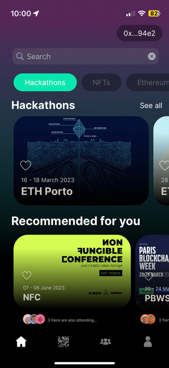

<!-- PROJECT LOGO -->
 

  <!--  -->

  <h3 align="center">Greenroom</h3>

  

    Hackathon - ETHPorto  
     
    <a href="#"><strong>Explore the docs »</strong></a>
     
     
    <a href="#">View Demo</a>
    ·
    <a href="#">Report Bug</a>
    ·
    <a href="#">Request Feature</a>
  

<!-- ABOUT THE PROJECT -->
## About The Project

<!-- mobile -->

  

Greenroom is a plateform that makes tech event participation seamless by leveraging web3 identity primitives to maximise both the event creator and participant experiences before, during and after the event; event creation, vibe-check, leveraging/building on-chain reputation, seamless on-boarding and ticketing, automated payouts and smart-networking.

Currently application experience for tech events, primarily hackathons is a bit all over the place. Applications are non-reusable (god forbid if you have to fill a Google form each time), tickets are sent by email, payments are processed via third party payment providers, networking is off-platform (Discord/Telegram) and managing them all is god's work

Greenroom combines these to have an end all solution in your palm. 
Why do we call it Greenroom? A greenroom is an away from the lights chill-out zone where you vibe with like minded folks and cut off the noise from the crowds where rep is your invite. That's what we are building.

### So how does it all work?

- An event organiser creates an event on Greenroom's smart contract. You just provide the name and dates and pay a staking fee (to keep out the bots and also keep bad actors away). The event metadata is stored on IPFS to keep the contract light, the event dates are essential since payouts and attendee participation is handled on-chain.

- A participant creates a bio on Greenroom once and gets an NFT for their profile with their skills as attributes. This profile also aggregates from other on-chain platforms (Otterspace, Lenster, Mazury, Guild.xyz etc) along with previous POAPs from other events added to your badge. 

- Your profile is your application itself and with each event you attend, it builds your rep.

- The payments are handled on-chain using Chainlink Keepers to trigger time-based unstaking upon event completion. Once an event is concluded, the

- We are currently deployed on Mantle because rare earth metals like Goerli were hard to find. 

## Technical Documentation

### Smart Contract

For this project, we decomposed it into multiple parts. First of all, we will have a smart contract managing the creation of new events, the joining system for the user... We build on ETH, our project is chain-agnostic so we can deploy on any EVM compatible chain. We decided to deploy it on ETH but also on Mantle for gas efficiency. This can be found in the `contract` folder.

- Mentle contract: 0x240aF64dF76D214a80dd15d218eEB33d8c30643D
- Goerli contract: 0xfe206A154FC0C4704Ae1a5b7ec0a9f2b7f7c4baF 

### Ticketing system

When an event is created and the participant are register, we can then create tickets for them. We decided to create a NFT for each participant representing a dedicated ticker for the event. 

For the ticketing system, we decided to use the DappKit framework from LayerX. A script is available for creating the NFT for each event and attendees.

> ./contract/scripts/event.ts

### Mobile App

A mobile app have been designed for this purpose. The user can use a mobile application to have access to the current events, see the coming one. This app seek to leverage on-chain data, by gathering information on previous events that the person has done. A match making system has been thinking but not implemented.

For the mobile application, it can be find in the `iOS Client` folder.

### Event Manager 

We create a web app for the events creation as it will be useful for organizer to plan and fill the event information.
It can be found in the `frontend` repository, you will find a React framework using Rocketkit for the UI component. 

### Unstack system 

We also imagine a system of stacking for the organizer of an event. This stacking system will force the creator to create an event, and to do it. This will avoid any bad behavior and scam for creating a fakes events. This stacking system will be a first barrier because you will need some cash to create event. This will also create confidence for the attendee as they know that the organizer put some money on the line for the event. After the event is passed, the money can be unstack. 

We also implement a ChainLink Automation system with a Time-base trigger. Indeed, when the event is finished, we want to unlock the stacking token of the owner. As we want to this process to be smooth as possible for the user, we do not want them additionnal interaction with the blockchain. Then, we think that a external trigger to unlock the token could be an interesting functionnality.

